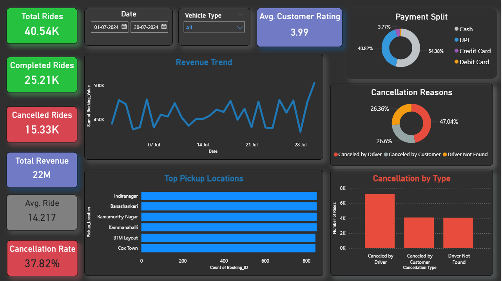

# OLA Ride Analytics Dashboard

## Tools Used
- Excel (Data Cleaning)
- Power BI
- DAX

## Project Description
Developed an interactive Power BI dashboard to analyze OLA ride booking data, focusing on ride completion, cancellations, revenue trends, and payment behavior.

## Dashboard Features
- KPI cards for Total Rides, Completed Rides, Cancelled Rides, Revenue, and Avg Ride Distance
- Cancellation analysis by driver, customer, and driver availability
- Payment method distribution
- Revenue trend over time
- Interactive slicers for Date and Vehicle Type

## Key Insights
- Driver-side cancellations contribute the highest share of incomplete rides
- UPI and Cash dominate payment methods
- Revenue shows fluctuating daily trends

## Preview

